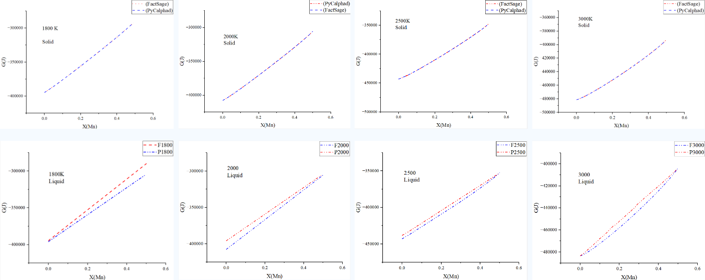

# Comparison with the calculation results of FactSage

The calculated results in the file "CaO_MnO_equilibrium.ipynb" were compared with those from FactSage, as shown in the following figure. For the solid solution phase, the calculated results of both are very consistent, but for the Liquid phase, there is a considerable deviation.

This is conducive to understanding that it is precisely due to the Gibbs free energy deviation of the liquid phase that the calculated results of the phase diagram for the CaO-MnO system are unacceptable.