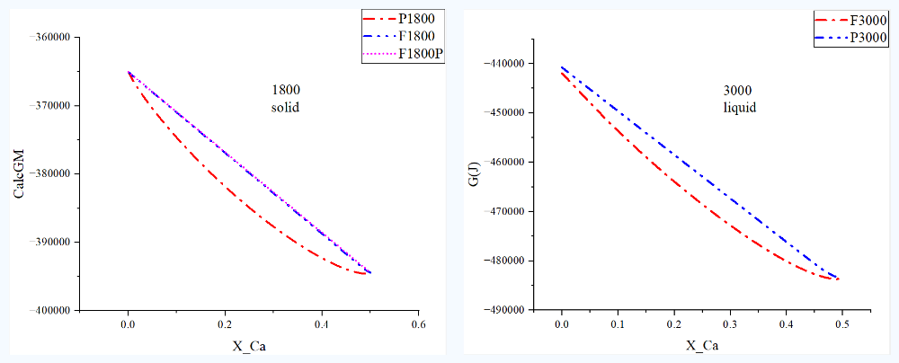
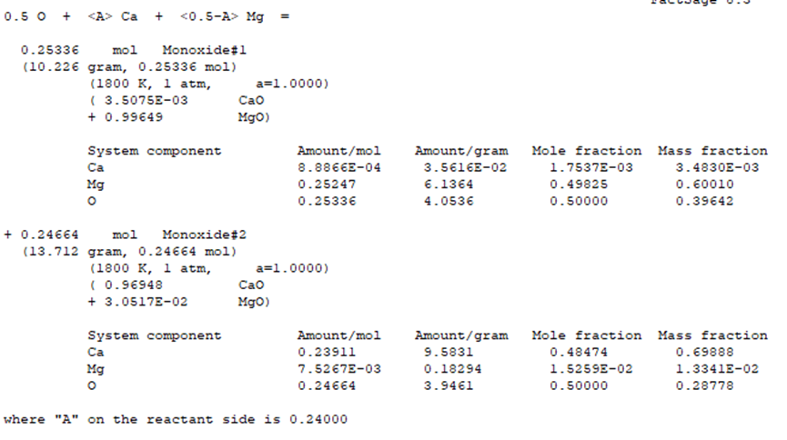

# Comparison with the calculation results of FactSage

The calculated results in the file "CaO_MgO_equilibrium.ipynb" were compared with those from FactSage, as shown in the following figure.

For the solid phase, there are some differences between the two. The reason is that FactSage treats the solid solutions in the CaO-MgO system as follows:

For the liquid phase, a similar phenomenon was observed in the CaO-MgO system as in the CaO-MnO system, that is, the higher Gibbs free energy of the liquid phase results in a larger solid phase region than expected.